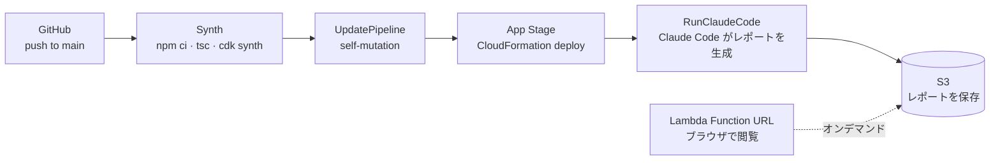

# Hephaestus

**Claude Code CLI を AWS パイプラインに組み込むデモ**です。

Claude Code をどこで・どのように呼び出すか、何を渡してどんな出力を得るかを、実際に動くインフラとして示すことを目的としています。デモのユースケースとして「CloudFormation スタックのデプロイ後に日本語レポートを自動生成する」シナリオを選択しています。

## デモの概要



### Claude Code の呼び出し方

App ステージの **CloudFormation デプロイ完了後**、`RunClaudeCode` という CodeBuild ステップ（post-step）が実行されます。compute type は Lambda 2 GB で、`scripts/build.sh` が Claude Code を呼び出します。

環境変数を展開したタスクプロンプトを `-p` で渡し、システムプロンプトを `--append-system-prompt-file` で追加しています。

```bash
claude -p "$TASK" \
  --model "$ANTHROPIC_MODEL" \
  --append-system-prompt-file /tmp/system_prompt.txt \
  --dangerously-skip-permissions \
  --max-turns 30 \
  --no-session-persistence
```

Claude Code はプロンプトに従って AWS API（CloudFormation, CodePipeline など）を自律的に呼び出し、`output/report.md` を生成します。

### プロンプトの管理

プロンプトは `prompts/` に置き、Amazon Bedrock Prompt Management でバージョン管理しています。CodeBuild の `pre_build` フェーズで最新版を取得し `/tmp/` に展開することで、コードを変更せずにプロンプトだけを更新・ロールバックできる構成にしています。

## ファイル構成

| ファイル | 役割 |
|---|---|
| `lib/pipeline-stack.ts` | CDK パイプライン定義 (CodeBuild ステップ・IAM・Bedrock 設定) |
| `lib/app-stack.ts` | レポートビューアー (S3 + Lambda Function URL) |
| `lambda/index.ts` | S3 のレポートを HTML にレンダリングして返す Lambda |
| `prompts/system-prompt.txt` | Claude Code のロール定義 (システムプロンプト) |
| `prompts/task-prompt.txt` | デプロイ後に実行するタスクのテンプレート |
| `scripts/install.sh` | Claude Code・uv のインストール |
| `scripts/pre_build.sh` | Bedrock Prompt Management からプロンプトを取得 |
| `scripts/build.sh` | `claude -p` 実行・レポートの S3 アップロード |

## 前提条件

- AWS アカウント（Amazon Bedrock で Claude Haiku 4.5 のクロスリージョン推論プロファイルへのアクセス権が必要）
- [AWS CDK v2](https://docs.aws.amazon.com/cdk/v2/guide/getting_started.html) と Node.js 20 以上
- GitHub リポジトリと AWS CodeConnections の接続 (connectionId)

## セットアップ

### 1. クローンと依存パッケージのインストール

```bash
git clone https://github.com/mahitotsu/hephaestus.git
cd hephaestus
npm ci
```

### 2. `cdk.json` に connectionId を設定

AWS コンソールで GitHub との CodeConnections 接続を作成し、接続 ID を設定します。

```json
{
  "context": {
    "connectionId": "<your-connection-id>"
  }
}
```

### 3. Bootstrap & デプロイ

```bash
npx cdk bootstrap
npx cdk deploy HephaestusPipelineStack
```

以降は main ブランチへの push がトリガーとなり、パイプラインが自動実行されます。

## サンプルレポート

実際に生成されたレポートのサンプルを [`samples/report-example.md`](samples/report-example.md) に収録しています。

## ライセンス

[MIT License](LICENSE)
